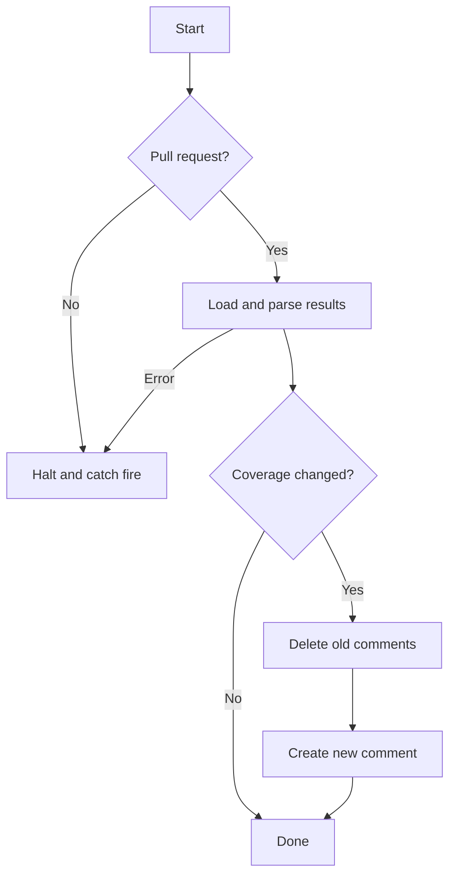

# simplecov-reporter-action

This is a simple GitHub action that takes the results of a simplecov coverage run and writes a
comment in a PR that includes current coverage, along with diffs against a baseline.

If there is no change in coverage, the action does nothing - any old coverage comment will be left
alone if it exists.

The comment will have a summary that shows project-wide coverage changes, and an initially collapsed
table that shows changes on a per-file basis. Only files which have coverage changes will be
included in the table.

**Contents**

- [What It Does](#what-it-does)
- [Important Notes](#important-notes)
- [Inputs](#inputs)
- [Outputs](#outputs)
- [Example Usage](#example-usage)
- [How Do I Manage the Baseline?](#how-do-i-manage-the-baseline)
  - [First run on push to main branch](#first-run-on-push-to-main-branch)
  - [First run on pull request](#first-run-on-pull-request)
- [TODO](#todo)
- [Example Output](#example-output)

## What It Does



## Important Notes

I made this for a work project, so the choices I've made reflect my personal preferences and needs.
This initial version solves _my_ problems. I will make this available on the GH marketplace, but I
have no clue if anyone else will ever use it. However, if people find it useful and want more
configurability or features, I am happy to discuss it via GH issues and pull requests.

Things that will cause this action to fail:

- running on a non-PR workflow - since this action adds issue comments, that's the only thing that
  makes sense to me
- missing the baseline resultset - the main idea of this action is to display coverage diffs

The underlying ruby coverage libaray (as far as I can tell) uses absolute paths for coverage entries
on each file. When the coverage report is generated, we remove `$GITHUB_WORKSPACE` from the start of
the path, keeping a relative path from the repo root. (This is something that could potentially be
configured in the future.) When comparing files for the diff, we have some options:

1. Keep an extra file along with the baseline that records the absolute path of the local checkout
   when the coverage was generated
2. Postprocess `.resultset.json` and remove the absolute path of the local checkout from each of the
   file entries
3. Do nothing and hope for the best

I rejected option 1 because it would be more painful to use, and it _appears_ so far that
`$GITHUB_WORKSPACE` is stable across runs and takes the form
`/home/runner/work/<repo name>/<repo name>`. I have only tested with the Ubuntu 22.04 runner at this
point. Option 2 seemed bad also - too much work, and potentially problematic. So I opted for option
3, which is in line with my overall laziness, and hopefully it just won't be a problem.

If for some reason the `$GITHUB_WORKSPACE` turns out not to be stable, I will have to revisit this.
If your first run of the action is on your main branch (see below in
[How Do I Manage the Baseline?](#how-do-i-manage-the-baseline)), then you _should_ have no problems
at all. If for some reason the absolute paths don't match, the overall diff should be correct, but
the per-file diff will include all the files, which is just noisy.

## Inputs

| Name                 | Required |                Default                | Description                                                     |
| :------------------- | :------: | :-----------------------------------: | :-------------------------------------------------------------- |
| `github-token`       |   Yes    |         `${{ github.token }}`         | GitHub token so we can add and delete comments                  |
| `baseline-resultset` |   Yes    | `'coverage-baseline/.resultset.json'` | Path of the JSON file representing baseline coverage statistics |
| `current-resultset`  |   Yes    |     `'coverage/.resultset.json'`      | Path of the JSON file representing current coverage statistics  |

## Outputs

None

## Example Usage

This is roughly how I use it:

```yml
name: CI

on:
  pull_request:
    branches:
      - main
  push:
    branches:
      - main

jobs:
  test:
    name: Lint & Test
      - # set up, run linter, etc., and generate coverage
      - name: Set up coverage baseline
        run: echo 'This is up to you...see below for my suggestion'
      - name: Report coverage
        if: github.event_name == 'pull_request'
        uses: keithlayne/simplecov-reporter-action@v1.0.0
        with:
          # these are all the defaults
          github-token: ${{ github.token }}
          baseline-resultset: ./coverage-baseline/.resultset.json
          current-resultset: ./coverage/.resultset.json
      - name: Update coverage baseline
        if: github.ref == 'refs/heads/main'
        run: echo 'On pushes to master, update the baseline'
```

This example amends the initial commit and force-pushes so that you only ever have a single commit
at `refs/coverage/baseline`, because I don't care about the history of that file. You can do
whatever you like.

## How Do I Manage the Baseline?

This is completely up to you -- but read this section anyway, as there may be some considerations
regardless of where you store the baseline. One reasonable approach is to store the single file in
some kind of cloud storage. However, I have a suggestion: use git.

I store the baseline in a ref that doesn't start with `refs/heads/`. This has a couple of nice
benefits, but for our purposes, it's a convenient place to stash files, and it's pretty cheap to
access in an action. It should never get in the way of your day-to-day git usage either.

Here's how you can use git to store the baseline resultset in a workflow (I use
`refs/coverage/baseline` for this):

```yml
jobs:
  test:
    steps:
      # ...
      - name: Checkout coverage baseline
        # drop the baseline into coverage-baseline
        run: |
          git fetch origin refs/coverage/baseline
          git worktree add coverage-baseline FETCH_HEAD
      - name: Report coverage
        # as above
      - name: Update coverage baseline
        if: github.ref == 'refs/heads/main'
        # or, if you only respond to pushes on main:
        # if: github.event_name == 'push'
        working-directory: coverage-baseline
        run: |
          # git is grumpy if you don't set this up - this will show the bot
          git config --global user.name "github-actions[bot]"
          git config --global user.email "41898282+github-actions[bot]@users.noreply.github.com"

          cp ../coverage/.resultset.json ./.resultset.json
          git add .resultset.json
          git commit --amend --message='Update coverage baseline'
          git push --force origin HEAD:refs/coverage/baseline
```

> **IMPORTANT:** The checkout step will not work unless that git ref exists in `origin`. This means
> if you use this method, it needs to be set up before this workflow runs the first time.

How you initially set up your baseline ref depends on if your first workflow run will be in the main
branch or in a PR.

### First run on push to main branch

This is simpler in theory, but I haven't tried it yet during development of this action. You should
be able to create an empty ref like this:

```sh
# Create an orphan branch
git checkout --orphan temp
# Add a single empty commit
git commit --message='Initial commit' --allow-empty
# Push it
git push origin HEAD:refs/coverage/baseline
```

Then clean up:

```sh
git checkout main
git branch --delete --force temp
```

At this point, the ref is set up with nothing in it but an empty commit. If you add this action to
your workflow in a PR, it will fail, but if you push the update to main first, it should simply
update the baseline ref, and future PRs from that point should show coverage diffs.

### First run on pull request

You need to do some initial setup to push your initial baseline result set:

```sh
# Make sure you're in the repo root
cd $(git rev-parse --show-toplevel)
# The baseline should represent the current state of your main branch in the origin
git checkout origin/main
# Generate coverage, I'm assuming it's at coverage/.resultset.json
rake test
# Create an orphan branch so we have a clean HEAD
git checkout --orphan temp
# clean up the branch (assuming you have ignored coverage dir in git)
git reset --hard
# Copy the json file to the root
cp coverage/.resultset.json .
```

At this point, you very likely need to munge the resultset file as discussed in
[Important Notes](#important-notes) so that your initial file diffs are correct. You can do this
however you want, but I have tested this (assuming an environment with GNU sed):

```sh
REPO=$(basename $(git remote get-url origin) .git)
sed -i "s|$(pwd)|/home/runner/work/${REPO}/${REPO}|" .resultset.json
```

This should leave you with a locally-generated, actions-compatible baseline. Now, push the munged
baseline resultset to `refs/coverage/baseline`:

```sh
# Create an initial commit
git add .resultset.json
git commit --message='Update coverage baseline'
git push origin HEAD:refs/coverage/baseline
```

Now you can clean up the temporary orphan branch:

```sh
git checkout main
git branch --delete --force temp
```

Now you have a special ref that has a single file holding your coverage baseline.

Now, in your workflow, before you run the coverage report, you can check this file out, and update
it after running tests when you're on the main branch:

## TODO

- Write tests
- Make some things configurable maybe
- CI
- License
- See if it actually works without branch coverage

## Example Output

---

## Ruby Test Coverage

|            | Lines | Lines Covered | Line Coverage | Branches | Branches Covered | Branch Coverage |
| :--------- | :---: | :-----------: | :-----------: | :------: | :--------------: | :-------------: |
| **Totals** | 3517  |     2833      |    80.55%     |   595    |     242 (+1)     | 40.67% (+0.17%) |

<details>
<summary>File Changes</summary>

|                | Lines | Lines Covered | Line Coverage | Branches | Branches Covered | Branch Coverage |
| :------------- | :---: | :-----------: | :-----------: | :------: | :--------------: | :-------------: |
| path/to/foo.rb |  13   |      11       |    84.62%     |    10    |      5 (+1)      |   50% (+10%)    |

</details>
