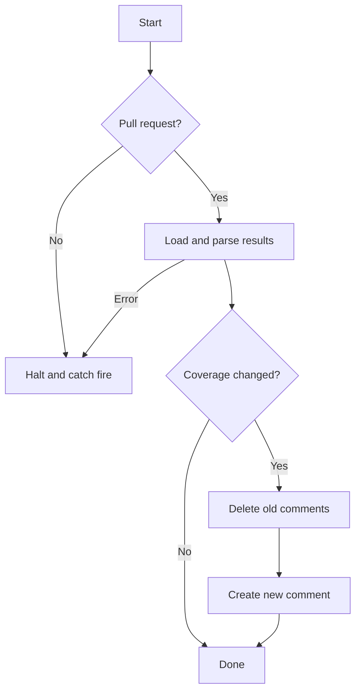

# simplecov-reporter-action

This is a simple GitHub action that takes the results of a simplecov coverage run and writes a
comment in a PR that includes current coverage, along with diffs against a baseline.

If there is no change in coverage, the action does nothing - any old coverage comment will be left
alone if it exists.

The comment will have a summary that shows project-wide coverage changes, and an initially collapsed
table that shows changes on a per-file basis. Only files which have coverage changes will be
included in the table.

## What It Does



## Important Notes

- I made this for a work project, so the choices I've made reflect my personal preferences.
- This will fail on any workflow that's not a pull request.
- The baseline is required - how you get that into the workflow context is up to you (see below).

## Inputs

| Name                 | Required |                Default                | Description                                                     |
| :------------------- | :------: | :-----------------------------------: | :-------------------------------------------------------------- |
| `github-token`       |   Yes    |         `${{ github.token }}`         | GitHub token so we can add and delete comments                  |
| `baseline-resultset` |   Yes    | `'coverage-baseline/.resultset.json'` | Path of the JSON file representing baseline coverage statistics |
| `current-resultset`  |   Yes    |     `'coverage/.resultset.json'`      | Path of the JSON file representing current coverage statistics  |

## Outputs

None

## Example Usage

This is roughly how I use it:

```yml
name: CI

on:
  pull_request:
    branches:
      - main
  push:
    branches:
      - main

jobs:
  test:
    name: Lint & Test
    runs-on: ubuntu-20.04

    steps:
      - uses: actions/checkout@v3
      - uses: ruby/setup-ruby@v1
        with: # your options
      - run: bin/rails test
      - name: Set up coverage baseline
        run: echo 'This is up to you...see below for my suggestion'
      - name: Report coverage
        if: github.event_name == 'pull_request'
        uses: keithlayne/simplecov-reporter-action@v0.1.0
        with:
          # these are all the defaults
          github-token: ${{ github.token }}
          baseline-resultset: ./coverage-baseline/.resultset.json
          current-resultset: ./coverage/.resultset.json
      - name: Update coverage baseline
        if: github.ref == 'refs/heads/main'
        run: echo 'On pushes to master, update the baseline'
```

## How Do I Manage the Baseline?

This is completely up to you. However, I have a suggestion: use git.

I store the baseline in a ref that doesn't start with `refs/heads/`. This has a couple of nice
benefits, but for our purposes, it's a convenient place to stash files, and it's pretty cheap to
access in an action. It should never get in the way of your day-to-day git usage either.

You need to do some initial setup to push your initial baseline result set:

```sh
# Make sure you're in the repo root
cd $(git rev-parse --show-toplevel)
# The baseline should represent the current state of your main branch
git checkout main
# Generate coverage, I'm assuming it's at coverage/.resultset.json
rake test
# Create an orphan branch so we have a clean HEAD
git checkout --orphan temp
# Copy the json file to the root
cp coverage/.resultset.json .
# You'll probably have a whole bunch of stuff staged...clear that out
git rm --cached -rf .
# Create an initial commit
git add .resultset.json
git commit --message='Update coverage baseline'
git push origin HEAD:refs/coverage/baseline
# go back to main
git checkout main
```

Now you have a special ref that has a single file holding your coverage baseline.

Now, in your workflow, before you run the coverage report, you can check this file out, and update
it after running tests when you're on the main branch:

```yml
jobs:
  test:
    steps:
      # ...
      - name: Checkout coverage baseline
        # drop the baseline into coverage-baseline
        run: |
          git fetch origin refs/coverage/baseline
          git worktree add coverage-baseline FETCH_HEAD
      - name: Report coverage
        # as above
      - name: Update coverage baseline
        if: github.ref == 'refs/heads/main'
        # or, if you only respond to pushes on main:
        # if: github.event_name == 'push'
        working-directory: coverage-baseline
        run: |
          # git is grumpy if you don't set this up - this will show the bot
          git config --global user.name "github-actions[bot]"
          git config --global user.email "41898282+github-actions[bot]@users.noreply.github.com"

          cp ../coverage/.resultset.json ./.resultset.json
          git add .resultset.json
          git commit --amend --message='Update coverage baseline'
          git push --force origin HEAD:refs/coverage/baseline
```

This example amends the initial commit and force-pushes so that you only ever have a single commit
at `refs/coverage/baseline`, because I don't care about the history of that file. You can do
whatever you like.

## TODO

- Write tests
- Make some things configurable maybe
- CI
- License
- See if it actually works without branch coverage

## Example Output

---

## Ruby Test Coverage

|            | Lines | Lines Covered | Line Coverage | Branches | Branches Covered | Branch Coverage |
| :--------- | :---: | :-----------: | :-----------: | :------: | :--------------: | :-------------: |
| **Totals** | 3517  |     2833      |    80.55%     |   595    |     242 (+1)     | 40.67% (+0.17%) |

<details>
<summary>File Changes</summary>

|                | Lines | Lines Covered | Line Coverage | Branches | Branches Covered | Branch Coverage |
| :------------- | :---: | :-----------: | :-----------: | :------: | :--------------: | :-------------: |
| path/to/foo.rb |  13   |      11       |    84.62%     |    10    |      5 (+1)      |   50% (+10%)    |

</details>
